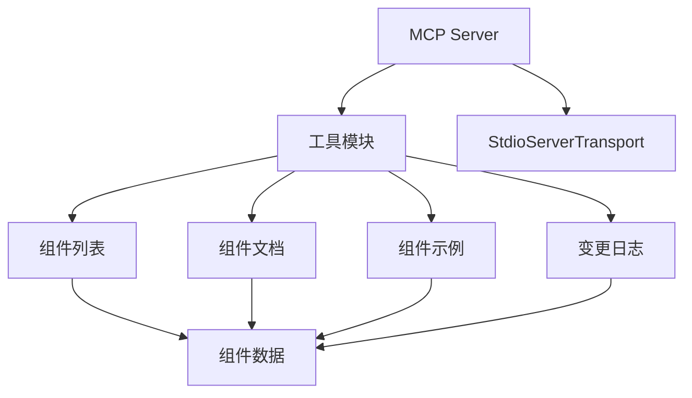
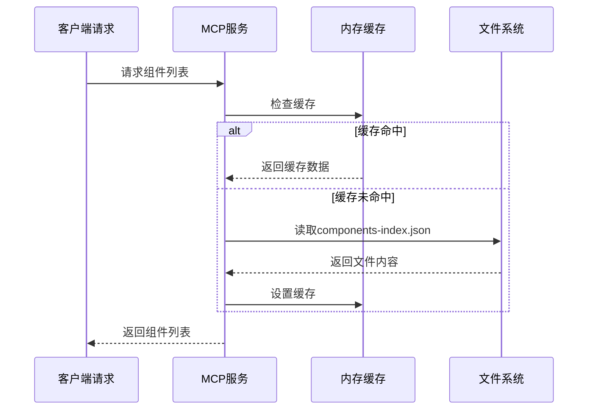
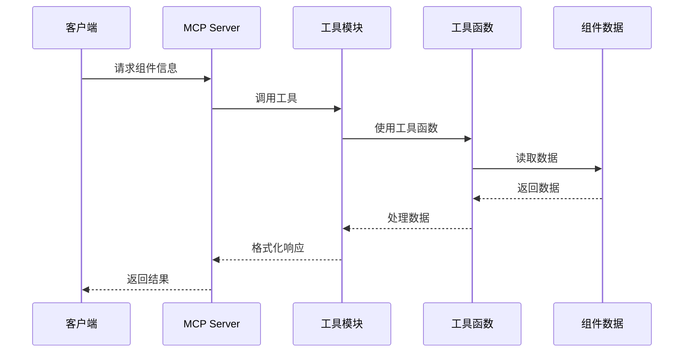
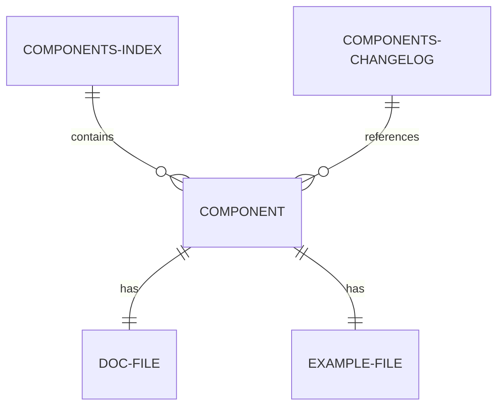
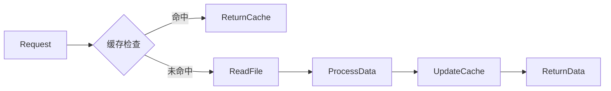
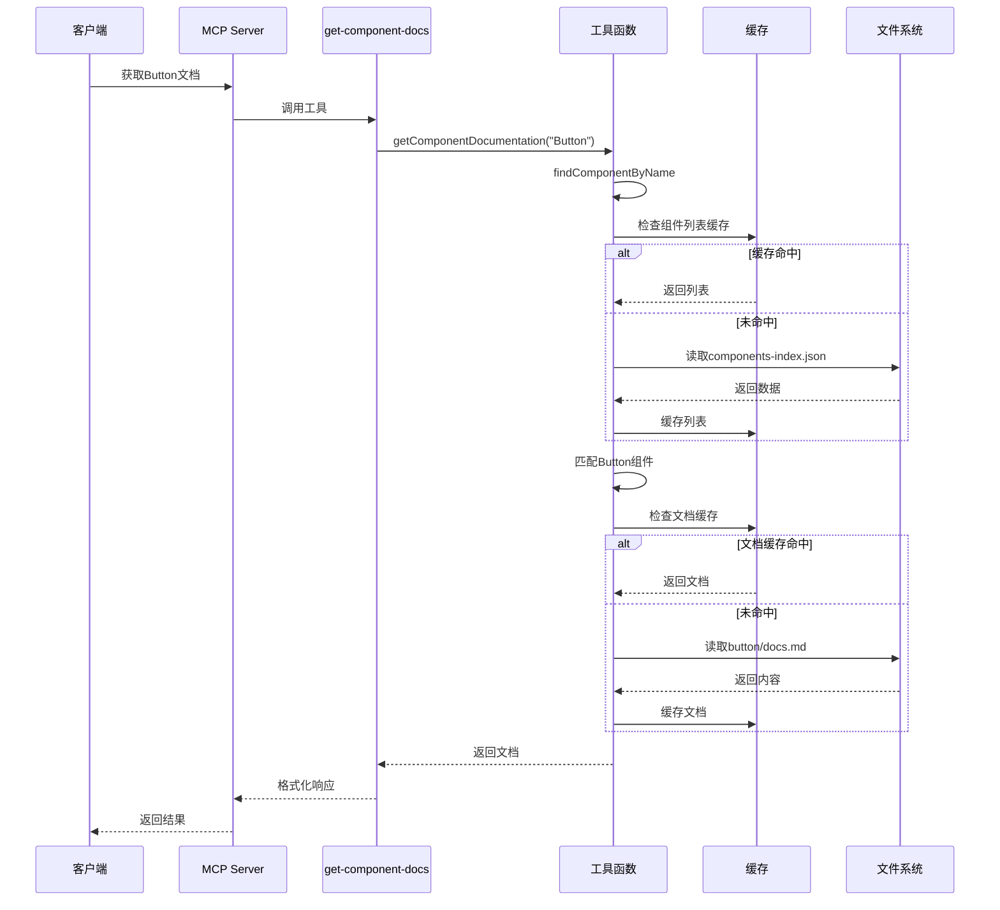
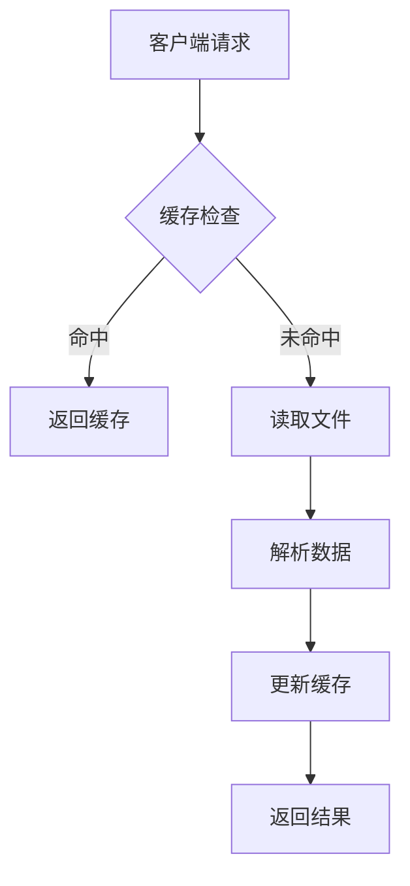

# Ant Design 组件 MCP 服务技术架构分析

## 整体架构


## 核心模块

### 1. MCP Server (src/server.ts)
- 服务入口，使用 @modelcontextprotocol/sdk 创建
- 注册4个核心工具：
  - list-components: 获取组件列表
  - get-component-docs: 获取组件文档
  - list-component-examples: 获取组件示例
  - get-component-changelog: 获取变更日志

### 2. 工具模块 (src/tools/)
- 每个工具对应一个独立文件
- 使用 Zod 进行参数验证
- 调用 utils/ 下的工具函数处理数据

### 3. 工具函数 (src/utils/)
- components.ts: 核心数据加载逻辑
  - 实现缓存机制
  - 加载组件列表/文档/示例/变更日志
- cache.ts: 缓存实现
- md-extract.ts: Markdown 内容提取

### 4. 数据存储 (componentData/)
- components-index.json: 所有组件元信息
  - name: 组件名
  - dirName: 目录名  
  - description: 描述
  - whenToUse: 使用场景
- components-changelog.json: 组件变更历史
- components/[组件名]/:
  - docs.md: 组件详细文档和API
  - examples.md: 使用示例代码

## 组件列表获取机制

### 数据来源
- **组件元数据文件**: `componentData/components-index.json`
- **文件内容**: 包含所有Ant Design组件的结构化信息
- **生成方式**: 通过`extract-docs.ts`脚本从Ant Design源码自动提取

### 核心字段说明
```typescript
interface ComponentData {
  name: string;       // 组件名称(如"Button")
  dirName: string;    // 组件目录名(如"button") 
  description: string; // 组件描述
  whenToUse?: string;  // 使用场景说明(Markdown格式)
  validVersion?: string; // 最低支持版本
}
```

### 获取流程


### 技术实现要点
1. **缓存机制**:
   ```typescript
   const componentCache = new Cache<CacheData>();
   // 优先从缓存读取
   const cacheComponentList = componentCache.get('componentsList');
   ```

2. **文件读取**:
   ```typescript
   const componentList = await readFile(EXTRACTED_COMPONENTS_LIST_PATH, "utf-8");
   const componentListJson = JSON.parse(componentList) as ComponentData[];
   ```

3. **查找组件**:
   ```typescript
   function findComponentByName(componentName: string) {
     const components = await loadComponentsList();
     return components.find(c => 
       c.name.toLowerCase() === componentName.toLowerCase() || 
       c.dirName.toLowerCase() === componentName.toLowerCase()
     );
   }
   ```

### 典型组件数据示例
```json
{
  "name": "Button",
  "dirName": "button",
  "description": "按钮用于开始一个即时操作。",
  "whenToUse": "## 何时使用\n\n标记了一个(或封装一组)操作命令..."
}
```

## 技术栈
- 语言: TypeScript
- 核心库: 
  - @modelcontextprotocol/sdk: MCP 协议实现
  - zod: 数据验证
  - vfile-matter: Markdown 解析
- 构建工具: tsup
- Node.js: >=16.0.0

## 数据流


## 组件数据结构


## 缓存机制


## 项目目录结构
```
antd-components-mcp/
├── componentData/            # 组件数据
│   ├── components-index.json # 组件索引
│   ├── components-changelog.json # 变更日志
│   └── components/           # 各组件文档和示例
│       ├── button/
│       │   ├── docs.md
│       │   └── examples.md
│       └── ...其他组件
├── src/
│   ├── server.ts             # MCP服务入口
│   ├── tools/                # 工具模块
│   │   ├── list-components.ts
│   │   ├── get-component-docs.ts
│   │   └── ...
│   ├── utils/                # 工具函数
│   │   ├── components.ts
│   │   ├── cache.ts
│   │   └── ...
│   └── constants/            # 常量定义
└── package.json              # 项目配置
```

## 设计特点
1. 模块化设计：功能按工具模块划分，职责单一
2. 缓存优化：减少文件IO操作，提高性能
3. 标准化数据：所有组件使用统一的数据结构
4. 完整文档：每个组件包含详细文档和示例
5. 版本控制：记录组件变更历史

## 示例
### 获取Button组件文档的完整流程

#### 1. 请求入口 (src/server.ts)
```typescript
// 注册get-component-docs工具
getComponentDocs(server);

// 客户端请求示例
// 当客户端请求组件文档时
// 会调用注册的get-component-docs工具
// await server.callTool('get-component-docs', { componentName: 'Button' });
```

#### 2. 工具模块 (src/tools/get-component-docs.ts)
```typescript
server.tool(
  "get-component-docs",
  "获取Ant Design组件文档",
  { componentName: z.string() },
  async ({ componentName }) => {
    const docs = await getComponentDocumentation(componentName);
    return {
      content: [{ 
        type: "text", 
        text: `${componentName}组件文档：\n${documentation}` }]
    };
  }
);
```

#### 3. 核心实现 (src/utils/components.ts)
```typescript
// 加载组件列表
export async function loadComponentsList() {
  try {
    // 检查缓存
    const cached = componentCache.get('componentsList');
    if (cached) return cached;
    
    // 读取文件 - 异步读取componentData/components-index.json文件
    const data = await readFile(EXTRACTED_COMPONENTS_LIST_PATH, "utf-8");
    // 解析JSON数据
    const list = JSON.parse(data) as ComponentData[];
    
    // 更新缓存
    componentCache.set('componentsList', list);
    return list;
  } catch (error) {
    console.error(`加载失败: ${(error as Error).message}`);
    return [];
  }
}

// 获取组件文档
export const getComponentDocumentation = async (componentName: string) => {
  // 查找组件
  const component = await findComponentByName(componentName);
  if (!component) return `组件${componentName}不存在`;

  // 检查文档缓存
  const cache = componentCache.get('componentsDoc') || {};
  if (cache[component.name]) return cache[component.name];

  // 构建文档路径
  const docPath = join(EXTRACTED_COMPONENTS_DATA_PATH, component.dirName, DOC_FILE_NAME);

  // 读取文档文件
  if (existsSync(docPath)) {
    const content = await readFile(docPath, "utf-8");
    // 更新缓存
    cache[component.name] = content;
    componentCache.set('componentsDoc', cache);
    return content;
  }
  
  return `未找到${component.name}的文档`;
};
```

#### 4. 数据文件路径
- 组件元数据: componentData/components-index.json
- Button文档: componentData/components/button/docs.md

#### 5. 完整调用流程


#### 5. 关键设计解析
1. **分层架构**：
   - Server层：处理请求/响应
   - Tool层：参数验证和流程控制
   - Utils层：核心业务逻辑
   - 文件系统：数据持久化

2. **缓存策略**：
   - 两级缓存：组件列表缓存 + 文档内容缓存
   - 内存缓存：使用Map结构存储
   - 缓存键：componentsList/componentsDoc

3. **错误处理**：
   - 组件不存在友好提示
   - 文档缺失明确报错
   - 文件读取异常捕获

4. **性能优化**：
   - 异步文件读取
   - 缓存优先策略
   - 单次加载多次使用

#### 6. 典型数据流

